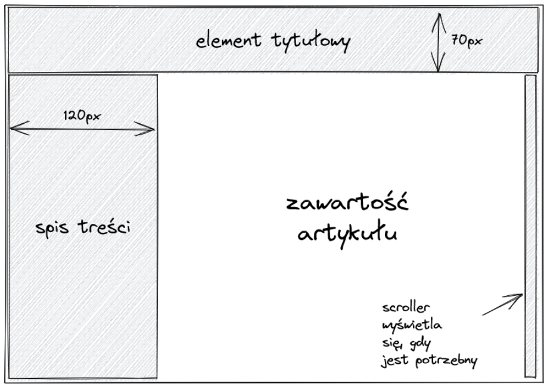
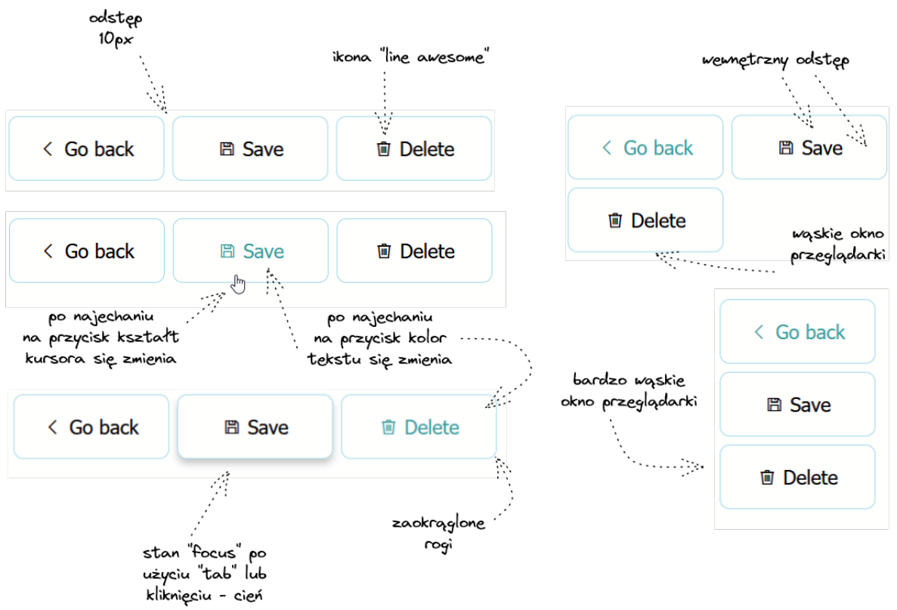
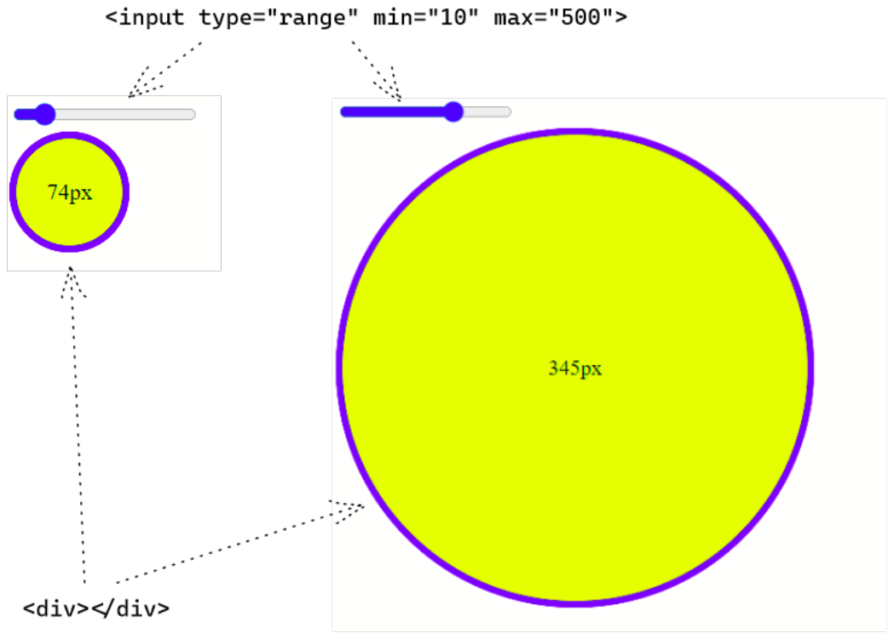
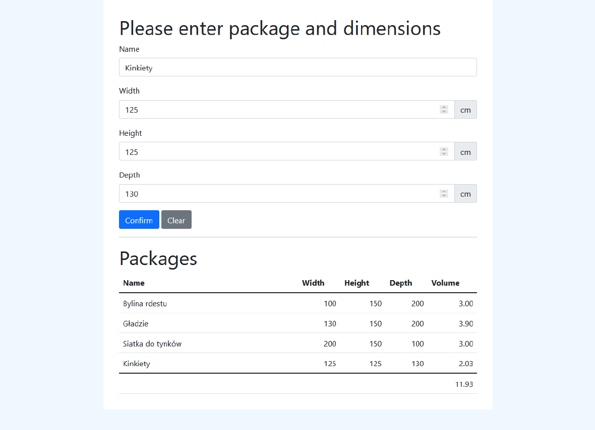

# PIISW, W-4, IO, 2021/2022, semestr letni

## Lista zadań nr 1: HTML i CSS

1. (5 pkt) Utwórz dokument `HTML 5` wraz z arkuszem styli zawierającym wszystkie z następujących 
elementów semantycznych: `article`, `section`, `p`, `h1`, `h2`, `h3` (wypełnij paragrafy treścią, np. lorem ipsum), 
który spełnia następujące warunki: \
    (a) krój pisma dla całej strony powinien być bezszeryfowy, \
    (b) maksymalna szerokość tekstu dokumentu powinna wynosić 1024 piksele, \
    (c) w przypadku monitorów o większej szerokości biały obszar z tekstem powinien wyświetlać się na środku ekranu, 
    po bokach powinny pojawić się jasnoszare marginesy
    o równej szerokości, \
    (d) odstępy między paragrafami powinny wynosić `2em`, \
    (e) odstępy między rozdziałami powinny wynosić `3em`, \
    (f) boczne marginesy tekstu powinny wynosić `3em`, \
    (g) górny i dolny margines tekstu powinien wynosić `2em`, \
    (h) zadbaj, aby elementy `h1`, `h2` i `h3` różniły się wielkością zgodnie z semantyką, \
    (i) dla wszystkich elementów występujących na stronie ustaw właściwość `box-sizing` na `border-box`.
    
    Elementy HTML muszą być użyte zgodnie z ich semantyką.
    
    

2. (7 pkt) Utwórz dokument HTML 5 wraz z arkuszem styli, który składa się ze znajdującego
   się zawsze na górze strony elementu tytułowego, ze spisu treści znajdującego się po lewej
   stronie oraz z zawartości (lorem ipsum) zajmującej zawsze całą pozostałą część ekranu. \
   Następujące warunki muszą być spełnione: \
   (a) obszar artykułu powinien się automatycznie dostosowywać do przeskalowywanego
   okna przeglądarki tak, aby zajmować całe dostępne miejsce, \
   (b) pionowy pasek przewijania powinien pojawić jedynie, gdy zawartość artykułu nie
   mieści się w obszarze, \
   (c) pionowy pasek przewijania powinien przesuwać jedynie zawartość artykułu, a nie
   całą stronę, \
   (d) pionowy pasek przewijania całej strony nigdy nie powinien być widoczny, \
   (e) wymiary pokazane na rysunku 2 muszą być zachowane, \
   (f) minimalna szerokość okna przeglądarki powinna wynosić `240px` (poniżej tej wartości
   powinien pojawić się pasek przewijania poziomego okna przeglądarki).

    

3. (6 pkt) Utwórz dokument zawierający panel trzech przycisków: `Go back`, `Save`, `Delete`
   (elementy typu button). Każdy przycisk powinien składać się z odpowiedniej ikony
   oraz etykiety. Należy usunąć wszelkie natywne style, jakie przeglądarka (Chrome) nakłada
   domyślnie na elementy button. \
   Najlepiej użyć ikon pochodzących z biblioteki `Font Awesome` lub `Line Awesome` - odpowiednią 
   bibliotekę proszę ściągnąć, rozpakować i umieścić w repozytorium. \
   Dodatkowo muszą być spełnione następujące warunki: \
   (a) przyciski muszą mieć ustaloną, jednakową szerokość; \
   (b) przyciski muszą być umieszczone w kontenerze, który zapewnia automatyczne ich
   rozmieszczenie w dwóch lub trzech wierszach, gdy brakuje miejsca; \
   (c) przyciski powinny zajmować miejsce począwszy od lewej strony, z odstępem `10px`
   między nimi; \
   (d) ramka przycisku powinna być niebieskawa, rogi powinny być zaokrąglone; \
   (e) po najechaniu na przycisk kursorem myszy, kształt kursora powinien się zmienić,
   zmianie powinien ulegać też kolor etykiety i ikony, nie powinno zmieniać się za to
   obramowanie; \
   (f) przycisk wybrany np. poprzez klawisz `TAB` powinien być zaznaczony cieniem.
    
    

## Lista zadań nr 2: JavaScript

1. (5 pkt) Obsługa zdarzeń modelu DOM. \
   Utwórz dokument `HTML` z osadzonymi stylami oraz z osadzonym kodem `JavaScript`,
   który wyświetli dwa elementy: kontrolkę suwaka oraz koło. \
   (a) Przyjmij zakres dopuszczalnych wartości suwaka jako 10 − 500. \
   (b) Średnica koła powinna być zawsze równa wartości ustawionej na suwaku (w pikselach). \
   (c) Średnica koła powinna zmieniać się dynamicznie podczas przesuwania suwaka. \
   (d) Wewnątrz koła, w jego geometrycznym środku powinna być zawsze wyświetlana jego średnica.

    Przykład wyglądu strony dla dwóch wybranych pozycji suwaka przedstawiono na rysunku. \
    Podpowiedź: koło można wyświetlić korzystając z odpowiednio ostylowanego elementu `div`.

    

2. (6 pkt) Formularze i walidacja. \
   W celu realizacji tego zadania użyj biblioteki styli Bootstrap:https://getbootstrap.com/. 
   Użyj pliku `bootstrap.min.css` zawartego w dystrybucji i zintegruj go z plikiem
   `index.html` będącym rozwiązaniem tego zadania. \
   Zrealizuj formularz pozwalający na wprowadzenie: nazwy, szerokości, wysokości i głębokości
   paczek. Wszelkie wymiary podawane są w centymetrach. \
   Po zatwierdzeniu, nazwa oraz wymiary, a także wyliczona objętość paczki powinna zostać
   dodana jako kolejny wiersz w tabeli znajdującej się poniżej formularza. Ponadto, w stopce
   tabeli powinna być wyliczona sumaryczna objętość wszystkich paczek. \
   Wygląd aplikacji powinien być zbliżony do tego z rysunku. Użyj odpowiednich styli
   z pakietu Bootstrap, aby to osiągnąć. \
   Spełnij poniższe wymagania: \
   (a) Wszystkie pola formularza są obowiązkowe. \
   (b) Pole nazwa powinno być polem tekstowym o maksymalnej długości 20 znaków, pola 
   wymiarów powinny być polami numerycznymi akceptującymi wartości całkowite
   z przedziału od 1 do 1000 cm. \
   (c) Naciśnięcie przycisku `Confirm` powinno przede wszystkim zainicjować walidację pól
   i wyświetlić odpowiednie komunikaty o błędach. \
   (d) Naciśnięcie przycisku `Clear` powinno wyczyścić zawartość formularza. \
   (e) Wyliczana wartość objętości powinna być zaprezentowana w metrach sześciennych
   oraz zaokrąglona do dwóch miejsc po przecinku. \
   (f) Użyj elementów semantycznych takich jak `form`, `table`, `input`, `label` oraz typów
   wejść jak `number`, `submit` oraz `reset`. \
   Wskazówka: pakiet Bootstrap posiada wsparcie dla walidacji (patrz rysunek) - pod
   warunkiem wykorzystywania możliwości, jakie daje `HTML5` w tym zakresie.

   
   

3. (7 pkt) Notatnik i składowanie danych Napisz prostą aplikację notatnika (widoczną na
   rysunku). Aplikacja powinna posiadać następujące funkcje: \
   (a) Tworzenie nowej notatki składającej się z tytułu i treści. Tytuł jest obowiązkowy. Po
   kliknięciu przycisku `Save` notatka powinna zostać dodana do listy po lewej stronie a formularz powinien zostać wyczyszczony. \
   (b) Wybór i edycja zapisanej notatki. Po kliknięciu na jedną z notatek na liście, za-
   wartość notatki powinna wyświetlić się w formularzu. Możliwa jest edycja zarówno
   tytułu jak i treści - po kliknięciu `Save` notatka powinna być zaktualizowana, pola
   formularza powinny zostać wyczyszczone, nowy tytuł notatki powinien zostać od-
   zwierciedlony na liście notatek. \
   (c) Notatki powinny zapisywać się w pamięci `localStorage` przeglądarki - po wciśnięciu
   CTRL-F5 i przeładowaniu strony, notatki powinny wciąż być widoczne.
   Przy ocenie tego zadania będziemy zwracać uwagę na styl:

   - Należy zadbać o możliwie dobrą separację logiki aplikacji i warstwy wizualnej.
   - Użyj obiektowości języka JavaScript tam, gdzie jest to potrzebne i uzasadnione.
   - Odseparuj stan lokalny aplikacji (lista notatek) oraz mechanizm utrwalania (localStorage) - 
    niech twoim jedynym modelem nie będzie wartość z localStorage!
   - Zwróć uwagę, że tytuł notatki nie musi być unikalny - zaproponuj sposób jedno-
    znacznej identyfikacji notatki.

    Zwróć uwagę na subtelną różnicę stanu aplikacji: aplikacja bezpośrednio po uruchomieniu
    prezentuje pusty formularz, który po zapisaniu zawsze skutkuje utworzeniem nowej notatki. 
    Gdy jednak notatkę wybierzemy z listy, zapis skutkuje aktualizacją już istniejącej
    notatki. Zwróć uwagę także, że po naciśnięciu przycisku `Save` stan formularza powinien
    być identyczny jak po uruchomieniu aplikacji - pola są wyczyszczone a formularz jest
    w trybie wprowadzania _nowej_ notatki. \
    Nie wolno używać dodatkowych bibliotek takich jak jQuery, Angular, React, itp. Wolno
    natomiast użyć Bootstrapa do stylowania widoku aplikacji.

[//]: # ()
[//]: # (## Lista zadań nr 3: Tworzenie i testowanie backendu: serwisy RESTowe)

[//]: # ()
[//]: # (1. &#40;6 pkt&#41; Order Service)

[//]: # (   Utwórz aplikację Order, która spełni następujące kryteria:)

[//]: # (   &#40;a&#41; będzie oparta naSpring Boot&#40;https://start.spring.io&#41;,)

[//]: # (   &#40;b&#41; zbudowana za pomocąMaven,)

[//]: # (   &#40;c&#41; wykorzysta bazę danychH2,)

[//]: # (   &#40;d&#41; dane z bazy danych będą dostępne pod adresem host:port/h2-console,)

[//]: # (   &#40;e&#41; wystawi REST API do tworzenia obiektu typu Order,)

[//]: # (   &#40;f&#41; wystawi REST API do aktualizacji statusu dostawy &#40;Created, PickedUp, Delivered&#41;)

[//]: # (   dla danego Order,)

[//]: # (   &#40;g&#41; definicja REST będzie możliwa do wyświetlenia z poziomu przeglądarki za pomocą)

[//]: # (   host:port/swagger-ui/index.html,)

[//]: # (   &#40;h&#41; encjaOrderpowinna zawierać informacje o kliencie, zamówionych produktach oraz)

[//]: # (   dostawie &#40;patrz rysunek 2.&#41;,)

[//]: # (   &#40;i&#41; ma odpowiednie pakiety wewnątrz warstwy: REST API, serwisową, dostępu do bazy)

[//]: # (   danych.)

[//]: # (2. &#40;5 pkt&#41; OrderHistory Service.)

[//]: # (   Utwórz aplikację OrderHistory, która spełni następujące kryteria:)

[//]: # (   &#40;a&#41; będzie oparta naSpring Boot&#40;https://start.spring.io&#41;,)

[//]: # (   &#40;b&#41; zbudowana za pomocąMaven,)

[//]: # (   &#40;c&#41; wykorzysta bazę danychH2,)

[//]: # (   &#40;d&#41; dane z bazy danych będą dostępne pod adresem host:port/h2-console,)

[//]: # (   &#40;e&#41; encjaOrderHistorypowinna zawierać informacje o kliencie, dostawie oraz zamówio-)

[//]: # (   nych produktach &#40;nazwy po przecinku w jednym polu&#41; wraz z sumaryczną wartością)

[//]: # (   zamówienia &#40;patrz rysunek 3.&#41;,)

[//]: # (   &#40;f&#41; ma oddzielone pakiety: REST API, serwisową, dostępu do bazy danych,)

[//]: # (   &#40;g&#41; wystawi REST API do tworzenia obiektu typuOrderHistory, aktualizacji jego sta-)

[//]: # (   tusu dostawy oraz odczytu danych tego typu &#40;GET - na podstawie id oraz wszystkich)

[//]: # (   zapisanych&#41;,)

[//]: # (   &#40;h&#41; definicja REST będzie możliwa do wyświetlenia za pomocą host:port/swagger-ui/index.html,)

[//]: # (   &#40;i&#41; strona swagger-ui/index.html grupuje operacje &#40;metody do odczytu oddzielnie od)

[//]: # (   tych do tworzenia, patrz 4 oraz 5&#41;,)

[//]: # (   &#40;j&#41; logika zawarta w serwisie jest pokryta testami jednostkowymi &#40;JUnit,Mockito&#41;.)

[//]: # ()
[//]: # ()
[//]: # (3. &#40;3 pkt&#41; Synchronizacja danych pomiędzy Order Service a OrderHistory Service.)

[//]: # (   Zarówno po utworzeniu obiektu typu Order jak i zmianie statusu jego dostawy przez)

[//]: # (   Order Service, dane w OrderHistory Service powinny zostać wzbogacone o te zmiany)

[//]: # (   &#40;synchronizacja&#41;. Do tego celu użyj REST API udostępnionego przez OrderHistory Se-)

[//]: # (   rvice.)

[//]: # (4. &#40;4 pkt&#41; Open API.)

[//]: # (   Aplikacja OrderHistory Service powinna udostępniać plik Open API &#40;.json lub .yaml&#41;,)

[//]: # (   który posłuży Order Service do wygenerowania kodu potrzebnego do połączenia poprzez)

[//]: # (   REST API z OrderHistory Service.)

[//]: # (   **Wskazówka:** Zacznij od wygenerowania pliku z definicją Open API &#40;https://springdoc.)

[//]: # (   org/&#41;. Następnie odpowiednio skorzystaj z mavenowego pluginu:openapi-generator-ma-)

[//]: # (   ven-plugin. Wygenerowany kod powinien znaleść się w katalogu target.)

[//]: # (5. A&#40;2 pkt&#41; RESTful API i paginacja.)

[//]: # (   Rozszerz działanie REST API w OrderHistory Service o metodę wyszukującą zamówienia)

[//]: # (   wraz z możliwością pagingu.)

[//]: # (   **Wskazówka:** Skorzystaj ze Spring HATEOAS.)

[//]: # ()
[//]: # ()
[//]: # (Rysunek 2: Model danych dla zadania 1.)

[//]: # ()
[//]: # (Rysunek 3: Model danych dla zadania 2.)

[//]: # ()
[//]: # ()
[//]: # (```)

[//]: # (Rysunek 4: Przykładowy widok grupy ordershistory na swagger-ui dla zadania 2.)

[//]: # (```)

[//]: # (```)

[//]: # (Rysunek 5: Przykładowy widok grupy sync na swagger-ui dla zadania 2.)

[//]: # (```)

[//]: # (Rysunek 6: Przykładowa zawartość pliku Open API do generowania kodu dla zadania 3.)

[//]: # ()
[//]: # ()
